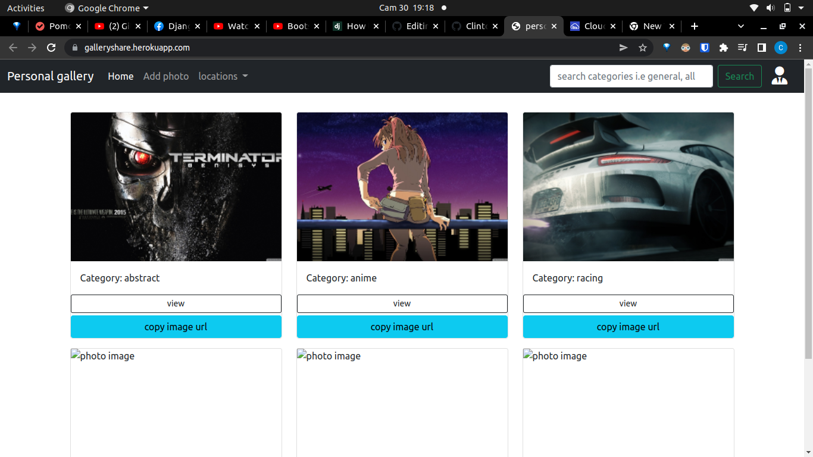

# photoshare-gallery

A personal gallery application that you can display your photos for others to see. Users can:

1. View different photos that interest them.
2. Click on a single photo to expand it and also view the details of the photo.
3. Search for different categories of photos. (ie. Travel, Food)
4. Copy a link to the photo to share with my friends.
5. View photos based on the location they were taken.

### Screenshot



## Getting Started

- Clone this repository to your computer. `git clone https://github.com/Clinton-dev/photoshare-gallery.git`
- Open terminal command line then navigate to the root folder `cd photoshare-gallery`
- Create virtual environment `python3 -m venv --without-pip <virtual environment name>`
- Run your virtual environment `source <virtual environment name>/bin/activate`
- Install Django in your environment `python -m pip install Django`
- Install other extensions required for the app to run `pip install -r requirements.txt`
- requirements.txt is in the root folder
- Run `python manage.py runserver`

### Prerequisites

Django requires Python and you can install python for your specific operating system by following this documentation [Python download](https://www.python.org/downloads/)


## Running the tests

Run test using the following command


```
python manage.py gallery test
```

## Deployment

Follow this resource if you want to deploy the app [deployment](https://github.com/bernie-haxx/Deployment_to_heroku_django)

## Built With

* [Django 4.0.4](https://docs.djangoproject.com/en/4.0/) - Backend framework used
* [Bootstrap 5.2 ](https://getbootstrap.com/docs/5.2/getting-started/introduction/) - frontend framework

### Link to Live Site
[Link to live site](https://galleryshare.herokuapp.com/)

## Author

* **Clinton Wambugu** - *Initial work* - [Clinton-dev](https://github.com/Clinton-dev)


## copyright & License Info
MIT Copyright (c) 2022 Clinton Wambugu

Permission is hereby granted, free of charge, to any person obtaining a copy of this software and associated documentation files (the "Software"), to deal in the Software without restriction, including without limitation the rights to use, copy, modify, merge, publish, distribute, sublicense, and/or sell copies of the Software, and to permit persons to whom the Software is furnished to do so, subject to the following conditions:

The above copyright notice and this permission notice shall be included in all copies or substantial portions of the Software.

THE SOFTWARE IS PROVIDED "AS IS", WITHOUT WARRANTY OF ANY KIND, EXPRESS OR IMPLIED, INCLUDING BUT NOT LIMITED TO THE WARRANTIES OF MERCHANTABILITY, FITNESS FOR A PARTICULAR PURPOSE AND NONINFRINGEMENT. IN NO EVENT SHALL THE AUTHORS OR COPYRIGHT HOLDERS BE LIABLE FOR ANY CLAIM, DAMAGES OR OTHER LIABILITY, WHETHER IN AN ACTION OF CONTRACT, TORT OR OTHERWISE, ARISING FROM, OUT OF OR IN CONNECTION WITH THE SOFTWARE OR THE USE OR OTHER DEALINGS IN THE SOFTWARE.


